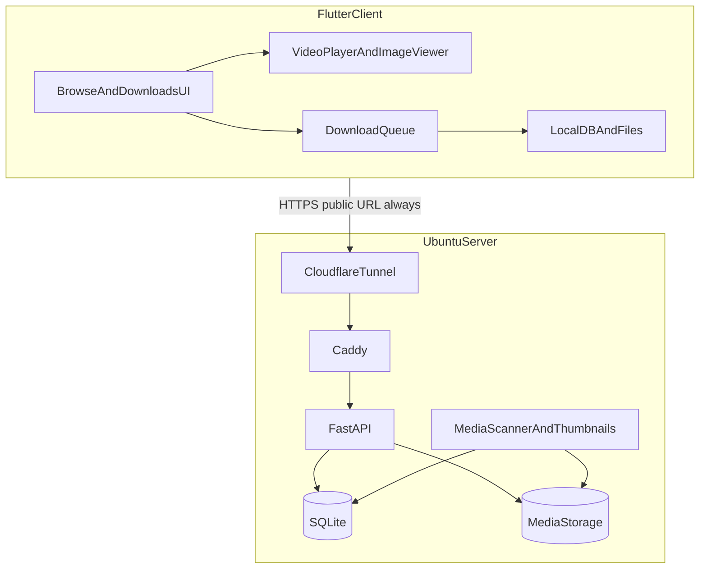
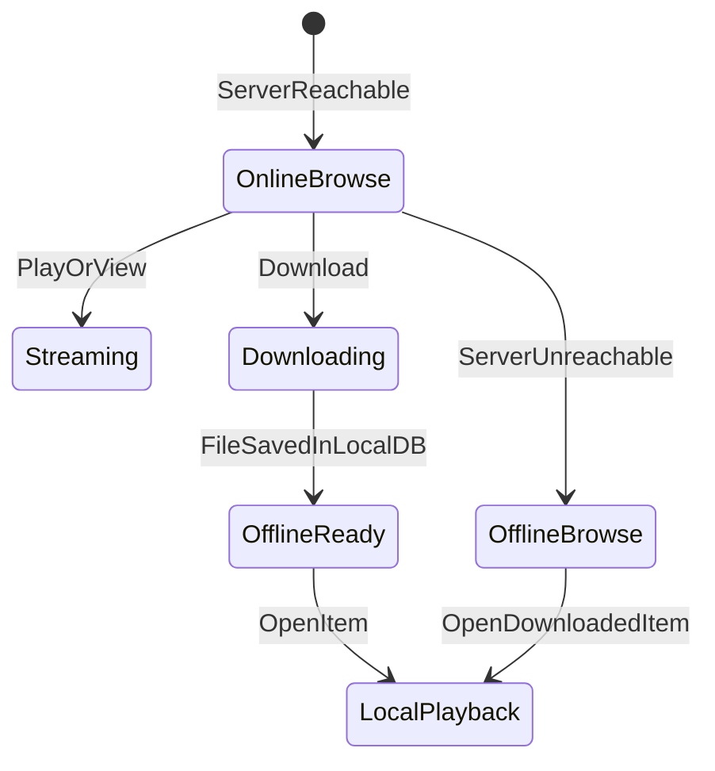

# Homemade Streaming Service — Project Plan

Self-hosted media platform: an Ubuntu server stores and serves a household image/video library over HTTPS; a Flutter client browses, streams/views online, and downloads for offline use with in-app download management.

Household members install **only the Flutter app**. No VPN app, no certificate import, no extra client software.

---

## 1. Goals

| Goal | Detail |
|------|--------|
| Server | Ubuntu box stores images/videos, indexes metadata, serves streaming and downloads over HTTPS |
| Client | Minimal Flutter UI; browse library; stream videos / view images live; download for offline; manage downloads in-app |
| Access | One public HTTPS URL, used at home and away |
| Users | Household accounts; shared library in MVP; per-user libraries/permissions later |
| Client installs | App only |
| Online / offline | Full library when reachable; downloaded items only when unreachable |

---

## 2. Locked decisions

These were chosen before implementation and should not be revisited without an explicit plan change.

| Topic | Decision |
|-------|----------|
| Who uses it | Household / family |
| Where it is reachable | Home Wi-Fi and the public internet |
| Remote access | **Cloudflare Tunnel** on the server (preferred). Alternative: port-forward 443 + Let’s Encrypt |
| Client extra apps | **None.** No Tailscale/WireGuard on phones |
| URL strategy | **Always** the public HTTPS URL (e.g. `https://media.example.com`), even on home Wi-Fi. No mDNS, no LAN IP, no split DNS in v1 |
| TLS | Publicly trusted cert (Cloudflare or Let’s Encrypt). No custom CA on devices |
| Client framework | **Flutter**. Ship **Android first**. Keep the **iOS** target in the same project; iOS device QA is not MVP. Desktop is out of v1 |
| Not Kotlin | Original Kotlin/Compose plan is superseded |
| Media formats (MVP) | Web-ready only: **MP4/WebM** (fast-start) and **JPEG/PNG/WebP**. Unsupported files are skipped, not listed as playable |
| Transcoding | Not in MVP. Documented upgrade path: remux/transcode MKV/HEVC/HEIC later |
| Library model (MVP) | One **shared household library**. Auth still required |
| Ingest (MVP) | Admin copies files onto the Ubuntu disk (SFTP / SMB / USB). No phone upload |
| App distribution (MVP) | Sideload a signed **Android APK**. Play Store later. iOS later via TestFlight |
| Download storage | App-private files so in-app delete frees space |
| Offline UI | Show **downloaded items only** when the server is unreachable; label that state clearly |

---

## 3. Architecture



At-home playback still traverses Cloudflare and is limited by **home upload** bandwidth. That is accepted for v1 simplicity.

### 3.1 Recommended stack

| Layer | Choice | Why |
|-------|--------|-----|
| Server API | Python FastAPI | Fast to build; async; good file/range-request support |
| Database | SQLite first; PostgreSQL only if needed | Household scale |
| Reverse proxy | Caddy | TLS / reverse proxy |
| Remote access | Cloudflare Tunnel (`cloudflared`) | No inbound ports; clients use a normal HTTPS URL |
| Video streaming | HTTP Range on MP4/WebM | Progressive stream + seek; HLS later if needed |
| Thumbnails | ffmpeg + Pillow | Video poster frames + image resize |
| Media probe | ffprobe | Duration, codecs, dimensions |
| Client | Flutter (Dart) | Android + future iOS from one codebase |
| Playback | `video_player` | ExoPlayer on Android, AVPlayer on iOS |
| Images | `cached_network_image` | Remote thumbs; local files when downloaded |
| HTTP | Dio | JSON API + auth interceptor |
| Downloads | `background_downloader` (or Dio + foreground work) | Queue, progress, resume |
| Local state | Drift or sqflite | Offline catalog + download queue |
| Secrets | `flutter_secure_storage` | Tokens, saved server URL |
| QR onboarding | `mobile_scanner` | Prefill HTTPS URL |

### 3.2 Repo layout

```
Self Sreaming/
  Plan.md
  docs/
    SETUP.md                 # Ubuntu, domain, Cloudflare Tunnel, first-run
  server/
    app/                     # FastAPI
      main.py
      routers/
      models/
      services/scanner.py
    requirements.txt
    Dockerfile
    docker-compose.yml
  client/                    # Flutter project
    lib/
    android/
    ios/                     # present; not a Phase 1 ship target
```

---

## 4. Part 1 — Ubuntu server

### 4.1 Disk layout

Mount large storage at `/mnt/media` (or symlink).

```
/mnt/media/library/shared/videos/
/mnt/media/library/shared/images/
/mnt/media/library/{username}/videos/    # Phase 3
/mnt/media/library/{username}/images/    # Phase 3
```

App data:

```
/opt/media-service/
  docker-compose.yml
  backend/
  data/
    db/                      # SQLite
    cache/thumbnails/
```

### 4.2 Core responsibilities

**Auth and accounts**

- Username + password (bcrypt).
- Short-lived JWT access token + refresh token stored hashed server-side.
- Roles: `admin` (users, rescan, bootstrap) and `member` (browse permitted library).
- First admin: `create-admin` CLI, or `BOOTSTRAP_ADMIN_USER` / `BOOTSTRAP_ADMIN_PASSWORD` on first start.
- Password reset: same CLI (no email).
- Logout / stolen device: revoke refresh tokens server-side.

**Media indexing**

- Watch or periodically scan `library/`.
- Extract: filename, size, duration, dimensions, mime type, path.
- Thumbnails: images → resized JPEG; videos → frame at ~10% duration.
- Allowed types only. Skip unsupported files; record skip reason; do **not** list them as playable.
- Optional on scan: `ffmpeg -movflags +faststart` remux for MP4s that are not fast-start (not full transcode).
- Store `playable` flag + skip reason in the database.
- Nightly scan job for newly dropped files.

**Streaming**

- Videos: `Accept-Ranges: bytes`; client player seeks via Range.
- Images: full image or `?size=thumb|full`.
- HLS / multi-quality: post-MVP.

**HTTPS and remote access**

- Named Cloudflare Tunnel + **stable hostname**. Ephemeral `trycloudflare.com` URLs are not acceptable (they change and break the app).
- Prerequisite: a domain or Cloudflare-managed hostname pointed at the tunnel.
- UFW: SSH; Cloudflare Tunnel needs **no inbound 443**. If using port-forward instead, allow 443 and run fail2ban + rate limits.
- Admin may use Tailscale for SSH/maintenance only; it is not a client access path.

### 4.3 Signed media URLs (required in Phase 1)

JSON calls use `Authorization: Bearer`. Flutter `video_player` and image widgets **do not** reliably attach that header.

Phase 1 API must mint **short-lived signed URLs** for stream, download, and thumbnail (query token bound to `media_id`, TTL on the order of hours), or equivalent cookie-based access after login.

Do not ship header-only media auth and patch the client later.

### 4.4 API (v1)

All library/media routes require a logged-in user (Bearer for JSON; signed token for media bytes).

| Method | Path | Purpose |
|--------|------|---------|
| POST | `/api/v1/auth/login` | Issue access + refresh tokens |
| POST | `/api/v1/auth/refresh` | Rotate/refresh access token |
| POST | `/api/v1/auth/logout` | Revoke refresh token |
| GET | `/api/v1/library` | Paginated playable media (`type=video\|image`) |
| GET | `/api/v1/media/{id}` | Metadata + signed thumbnail/stream/download URLs |
| GET | `/api/v1/media/{id}/stream` | Range-aware stream (signed) |
| GET | `/api/v1/media/{id}/download` | Full file; Range for resume; `Content-Disposition: attachment` (signed) |
| GET | `/api/v1/media/{id}/thumbnail` | Poster/thumbnail (signed) |
| GET | `/api/v1/onboarding/qr` | Admin: payload with public HTTPS base URL |
| POST | `/api/v1/admin/scan` | Admin: trigger library scan |
| DELETE | `/api/v1/admin/media/{id}` | Admin: remove from index (optional MVP) |

### 4.5 Ubuntu setup checklist (22.04 / 24.04)

- Install Docker, Docker Compose, ffmpeg (in image or host), Caddy (or in Compose), `cloudflared`.
- Bind-mount media disk into the backend container.
- Systemd or `docker compose up -d`.
- Create admin user; drop sample MP4 + JPEG; run scan.
- Verify with curl: login, list, Range stream, download — against the **public HTTPS URL**.

---

## 5. Part 2 — Flutter client

### 5.1 Logical layers

```
client/lib/
  ui/            # screens (minimal)
  data/          # API, local DB, repositories
  download/      # queue, progress, resume
  player/        # video + image viewers
```

### 5.2 Screens

1. **Login / onboarding** — scan QR (prefilled HTTPS URL) or paste URL once; username + password; store in secure storage.
2. **Library** — thumbnail grid/list; filter All / Videos / Images; pull-to-refresh.
3. **Detail** — title, size, duration; **Play/View**, **Download**, **Delete local copy** if downloaded.
4. **Player / viewer** — video fullscreen from signed stream URL or local file; zoomable image from network or local file.
5. **Downloads** — queued / downloading / completed / failed; pause, resume, cancel, retry, delete; storage used; optional Wi-Fi-only setting.

### 5.3 Online vs offline



- Repository: remote list when online; local downloaded catalog when offline.
- Downloads: stream to app-private `downloads/{mediaId}.ext`; statuses `QUEUED`, `DOWNLOADING`, `COMPLETED`, `FAILED`; byte progress; local path.
- Check free space before queueing.
- Download endpoint **must** support HTTP Range or pause/resume is fake.
- Android MVP: foreground notification (Android 14+ `foregroundServiceType` applies under the plugin).
- iOS later: background `URLSession` is stricter; keep queue UI honest. Do not block Android MVP on iOS download parity.
- JSON 401: refresh token once, retry; if refresh fails, return to login.

### 5.4 Suggested packages (MVP)

| Need | Package |
|------|---------|
| HTTP | `dio` |
| Video | `video_player` (+ thin fullscreen wrapper) |
| Images | `cached_network_image` |
| DB | `drift` or `sqflite` |
| Secrets | `flutter_secure_storage` |
| Downloads | `background_downloader` |
| QR | `mobile_scanner` |

### 5.5 Platform notes

- **Android minSdk**: 26 unless older phones are required.
- **iOS**: generate/keep the iOS folder; do not require TestFlight or device QA for Phase 1.
- Chromecast, PiP, and desktop are out of v1 (plugin/OS cost).

---

## 6. Security

- Never store plaintext passwords on device or server.
- HTTPS with a publicly trusted certificate.
- Cloudflare Tunnel preferred: no open inbound media ports; DDoS fringe benefit; clients still use only the app.
- If port-forward is used instead: strong passwords, rate limiting, fail2ban, keep Ubuntu patched.
- JWT signing secret in server environment, not in git.
- The public URL alone must not grant library access.
- Signed media URLs expire; do not log them in client crash reports.

### Who installs what

| Person | Installs | Notes |
|--------|----------|-------|
| Server admin | Ubuntu packages, Docker, ffmpeg, Caddy, cloudflared | One-time; not per household member |
| Household members | Flutter app only | QR or URL once + username/password |

---

## 7. Implementation phases

### Phase 1 — Server MVP

- FastAPI: auth, SQLite, bootstrap admin CLI, models.
- Scanner: allowed types, `playable` flag, thumbnails, optional MP4 fast-start remux.
- Stream + download with Range; signed URLs for stream/download/thumbnail.
- Docker Compose + Caddy + named Cloudflare Tunnel.
- `docs/SETUP.md`: domain, tunnel, storage mount, first-run.

**Exit criteria:** Login, list playable media, stream a fast-start MP4 with seek, download a file — all over the public HTTPS URL (curl/browser is enough).

### Phase 2 — Flutter Android MVP

- Login (URL + QR) + library grid + detail.
- Online video stream and image view via signed URLs.
- Single-item download; play local file in airplane mode.
- Basic Downloads screen (status, cancel, delete, storage used).

**Exit criteria:** Happy path on a real Android device; offline playback after airplane mode. iOS compile-success is optional; iOS QA is not required.

### Phase 3 — Household polish

- Per-user private folders / `UserMediaAccess`.
- Download queue (multiple items), pause/resume, Wi-Fi-only.
- Thumbnails in the grid (if not already solid).
- Logout and refresh-token revoke.

### Phase 4 — Optional (post-MVP)

- HLS or transcode for slow uplinks / mixed codecs (MKV, HEVC, HEIC).
- Admin web UI (users, rescan, storage).
- Continue watching / progress sync.
- Search and sort.
- iOS TestFlight QA and background-download parity.
- Play Store listing.

---

## 8. Testing

- **Server:** pytest for auth and access control; curl for Range requests and signed-URL expiry.
- **Client:** manual QA — stream, seek, download, airplane mode, cancel/delete download, offline empty vs downloaded library.
- **E2E:** at least one test video and one image in `shared/`; confirm unsupported files do not appear as playable.
- **Tunnel reality check:** play a **>1 GB** file with seek and two concurrent devices. If home upload cannot sustain it, move quality/transcode up from Phase 4 without expanding MVP.

---

## 9. Work breakdown (implementation order)

1. Scaffold FastAPI + SQLite + Docker/Caddy: bootstrap admin, JWT, signed media URLs, Range support.
2. Media scanner: allowed types, playable flag, optional fast-start remux, thumbnails.
3. `docs/SETUP.md`: domain, named tunnel, storage mount, app-only clients.
4. Flutter scaffold (Android first): login, Dio, local DB, secure storage; iOS target present.
5. Library grid, `video_player` + image viewer on signed URLs.
6. Download queue with Range resume, notifications, app-private storage, Downloads screen.
7. QA: large-file seek over the tunnel, airplane-mode playback, skipped unsupported files.

---

## 10. Features not in the original request (backlog)

Worth considering after MVP. Not Phase 1–2 unless a later decision says otherwise.

1. Per-user watch progress / resume across devices
2. Search and filters (title, date, type, duration, folder)
3. Sort (newest, name, size, recently added)
4. Albums / folders / tags
5. Admin web dashboard
6. Upload from the phone (camera-roll backup)
7. Subtitles (`.srt` / `.vtt`)
8. Multiple quality / transcoding (1080p/720p)
9. Chromecast / DLNA
10. PIN or biometric lock on the app
11. Parental controls / ratings
12. Shared vs private libraries (Phase 3 starts this)
13. Storage quotas per user
14. Server health (disk alerts, failed scans)
15. Automatic organization / rename on ingest
16. Duplicate detection (content hash)
17. Soft delete / trash
18. Backup strategy for DB + media
19. Certificate pinning or TOFU
20. Offline conflict if the server file changed after download
21. Picture-in-picture and background audio
22. Grid vs list and dark mode polish
23. QR pairing (onboarding is in MVP; extra pairing UX can grow)
24. Multi-server / failover
25. TMDB/IMDB metadata enrichment
26. Flutter desktop (Windows / Linux / macOS)

---

## 11. Out of scope for v1

- Tailscale/WireGuard as the phone access path
- LAN auto-detect, mDNS, split-horizon DNS
- Custom CA / user-installed certificates
- Full transcoding pipeline
- Phone upload
- iOS production distribution
- Desktop clients
- Public unauthenticated library
